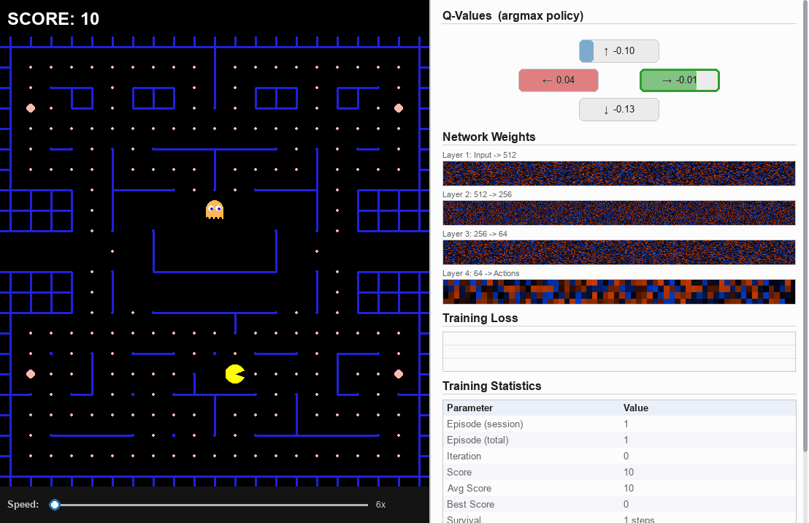

In English | [中文版](README_zh.md)

# PacMan Deep Q-Network (DQN)

A classic Pac-Man game that doubles as a hands-on Deep Q-Network (DQN) learning environment. Play it yourself, train a DQN agent, or watch the agent learn in real time with a live visualization of network internals.

<p align="center">
  
</p>

## Why this project?

Most DQN tutorials stop at theory or use trivial environments. This project lets you **see** DQN learning on a real game:

- Watch Q-values shift as the agent discovers strategies
- See weight heatmaps evolve during training
- Observe how exploration (epsilon) decays into exploitation
- Understand reward shaping by tweaking it and seeing the effect

## Quick Start

```bash
git clone https://github.com/chuanbei2026/pacman-gym.git
cd pacman-gym

# Install the package
pip install -e .

# Play the game yourself
python3 -m pacman_gym

# Train a DQN agent (headless)
python3 -m pacman_gym train

# Watch the trained agent play
python3 -m pacman_gym play

# Live training visualization (recommended)
python3 -m pacman_gym teach
```

## Modes

### Play (`python3 -m pacman_gym`)

Classic Pac-Man with arrow keys. Eat all dots to win, avoid ghosts, grab power pellets for invincibility.

### Teach (`python3 -m pacman_gym teach`)

The main attraction. Opens a split-screen window:

- **Left**: the game running in real time
- **Right**: a research-style panel showing:
  - **Q-Values**: the agent's estimated value for each direction (argmax policy)
  - **Weight Heatmaps**: live visualization of each layer's weights
  - **Loss Curve**: training loss over time
  - **Stats Table**: episode count, score, epsilon, buffer size, etc.
- **Bottom**: speed slider to control training speed (1x to 360x)

Training runs asynchronously -- a background thread updates the network while the main thread handles rollout and rendering, so neither blocks the other.

### Train (`python3 -m pacman_gym train`)

Headless training for maximum speed. Saves the best model checkpoint automatically.

```bash
python3 -m pacman_gym train --episodes 5000
```

### Play Agent (`python3 -m pacman_gym play`)

Load a trained model and watch the agent play. Press SPACE to restart, ESC to quit.

## How the DQN Works

### Background

**Deep Q-Network (DQN)** is a reinforcement learning algorithm introduced by DeepMind in [Playing Atari with Deep Reinforcement Learning](https://arxiv.org/abs/1312.5602) (Mnih et al., 2013) and later refined in [Human-level control through deep reinforcement learning](https://www.nature.com/articles/nature14236) (Mnih et al., 2015). The core idea:

1. **Q-Learning** estimates the expected future reward for taking action *a* in state *s*: Q(s, a). The agent always picks the action with the highest Q-value (greedy policy).

2. **The problem**: In complex environments, we can't store Q-values for every possible state in a table -- there are too many states. DQN solves this by using a **neural network** to approximate Q(s, a).

3. **Experience Replay**: The agent stores past transitions (s, a, r, s') in a buffer and trains on random mini-batches. This breaks correlation between consecutive samples and improves stability.

4. **Target Network**: A separate, slowly-updated copy of the Q-network is used to compute TD targets. This prevents the "moving target" problem where the network chases its own shifting predictions.

This project implements **Double DQN** ([van Hasselt et al., 2015](https://arxiv.org/abs/1509.06461)), which reduces Q-value overestimation by using the policy network to *select* actions but the target network to *evaluate* them.

### Observation (258 features)

Instead of raw pixels, the agent sees a compact feature vector:

| Feature | Dims | Description |
|---------|------|-------------|
| Local grid | 225 | 15x15 area around Pac-Man (walls, dots, ghosts encoded spatially) |
| Ghost info | 24 | Each ghost's relative position, distance, direction, active/stunned |
| Pac-Man direction | 1 | Current movement direction |
| Invincible | 1 | Whether power pellet is active |
| Dot scan | 4 | Distance to nearest dot in each direction (corridor scan) |
| Nearest dot | 2 | Relative position to closest dot globally |
| Dots remaining | 1 | Ratio of dots left |

### Network Architecture

```
Input (258) -> Linear(512) -> ReLU -> Linear(256) -> ReLU -> Linear(64) -> ReLU -> Linear(4)
```

Outputs 4 Q-values, one per direction (UP, RIGHT, DOWN, LEFT). The agent picks the direction with the highest Q-value.

### Reward Shaping

| Event | Reward |
|-------|--------|
| Eat dot | +10 |
| Eat power pellet | +50 |
| Eat apple | +100 |
| Eat ghost (invincible) | +200 |
| Win (all dots eaten) | +500 |
| Killed by ghost | -1000 |
| Direction reversal | -5 |
| Visit new tile | +2 |
| Per step (time pressure) | -(0.5 + step/200) |

### Training Details

- **Algorithm**: Double DQN with experience replay
- **Async training**: rollout uses a frozen policy copy; a background thread trains the live network
- **Maze fuzzing**: 5 maze variants selected randomly each episode for generalization
- **Epsilon schedule**: linear decay from 1.0 to 0.05 over 80k steps
- **Replay buffer**: 200,000 transitions
- **Batch size**: 128
- **Target network sync**: every 500 training steps

## Project Structure

```
pacman-gym/
  pyproject.toml
  README.md
  LICENSE
  src/
    pacman_gym/
      __main__.py   # Entry point and CLI routing
      game.py       # Core game engine (pure logic, no rendering)
      main.py       # Pygame UI for manual play
      gym_env.py    # Gymnasium environment wrapper
      train.py      # DQN agent, training loop, replay buffer
      teach.py      # Live training visualization
```

## References

- Mnih et al., [Playing Atari with Deep Reinforcement Learning](https://arxiv.org/abs/1312.5602), 2013
- Mnih et al., [Human-level control through deep reinforcement learning](https://www.nature.com/articles/nature14236), 2015
- van Hasselt et al., [Deep Reinforcement Learning with Double Q-learning](https://arxiv.org/abs/1509.06461), 2015

## License

MIT
